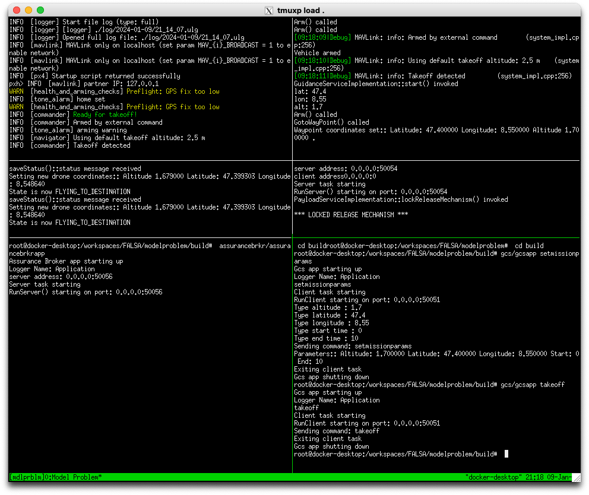

# Model Problem: Getting Started
These instructions explains how to build and run the code using a Docker
container, which provides the right versions of all the dependencies.
Instructions for how to build the code without Docker are in
[build-details.md](doc/build-details.md).

These instructions have been tested in Linux and macOS.

There are two options. One is to build it and run it from a terminal, and the
other is to do that in VS Code using a dev container.

## Prerequisites
You need to have Docker Desktop, configured so that your user can use Docker.
In macOS, you also need XQuartz.
For the VS Code option, you need VS Code installed.

### XQuartz in macOS
You need to install XQuartz and set its Security preferences to *Authenticate
connections* and *Allow connections from network clients*.

The following needs to be run once in a terminal to configure XQuartz.

```
defaults write org.xquartz.X11 enable_iglx -bool YES
```

If XQuartz was already running, close and restart it.

In addition, the command `xhost +localhost` has to be run in the host before an
app in the container is allowed to connect. **Important:** this needs to be done again each time XQuartz or the Mac is restarted.

## Building and running from a terminal
After you have cloned the repository, open a terminal and go to the directory
where this file is. Then, execute the following command that will create the
Docker container and start it so that the code can be built and run.

```
./start-container.sh
```
Once inside the container, use the following commands to build the code.
```
mkdir build
cd build
cmake ..
make
cd ..
```

Follow the instructions in [Running the model problem](#running-the-model-problem).

## Dev Container setup for VS Code
With this setup it is possible to use VS Code to develop the model problem
with the code being built and run in a Docker container.

### VS Code
Follow the [VS Code Dev Containers tutorial](https://code.visualstudio.com/docs/devcontainers/tutorial) up to the section "Check installation"


### Getting started with the container
After you clone the repository, start VS Code and open the folder where this file is.

To start developing in the container, press F1 in VS Code and select *Dev Containers: Reopen in Container*
- you can start typing to filter the commands
- the first time will take a long time to build the container image

After that succeeds, VS Code development environment will use the container to build and run code, but your edits to the files will be saved in your local file system.

#### Troubleshooting
If you get an error
`You don't have enough free space in /var/cache/apt/archives/`
while the container builds, go to Docker settings and increase the virtual
disk size.

### Building the code
The project will be configured to be built automatically by the CMake Tools extension installed in the container (it may ask the first time).
If it doesn't configure the project nor ask, you may need to install the CMake Tools extensions in the container. Just click `CMakeLists.txt` and it should prompt to install it.

To build the project, click on the *Build* command in the bottom bar of VS Code, or in the file explorer view of VS Code, right-click on `CMakeLists.txt` and click on *Build All Projects*. Note that VS Code may suggest to install the CMake extension. If it does, you need to install it in the container because it was not installed at build time.

The first time is built, you will get a prompt at the top of VS Code to select a build environment. Select "[unspecified]"

## Running the model problem
To run the model problem, you need to access a terminal in the container.
In VS Code: click on *TERMINAL* on the window below the code editor, close to where the build output is shown.
If you are not using VS Code, just use the `start-container.sh` command
described above.

To launch the model problem, enter the following in the terminal:
```
./launch.sh
```

That will open a large terminal window split into six different panes running the different components of the model problem.
This window splitting into panes is done with *tmux*, so if you need help to navigate between them, see the section *Changing the active pane* in [this guide](https://github.com/tmux/tmux/wiki/Getting-Started#changing-the-active-pane).
Basically, press `Ctrl-b` followed by an arrow key to switch between panes.

When it starts, the GCS pane is selected. Here's a screenshot of sample session.
Note that you have to invoke gcs with `gcs/gcsapp`.



For a test run, enter the following command in the GCS pane.

```
gcs/gcsapp setmissionparams
```

The following parameters work well for an example or demonstration:
- Altitude: 1.7
- Latitude: 47.4
- Longitude: 8.55
- Start Time: 0
- End Time: 10

Then enter the following command:

```
gcs/gcsapp takeoff
```

To close all the model problem applications, execute the following in the same terminal where you executed `./launch.sh`:

```
./closeall.sh
```


